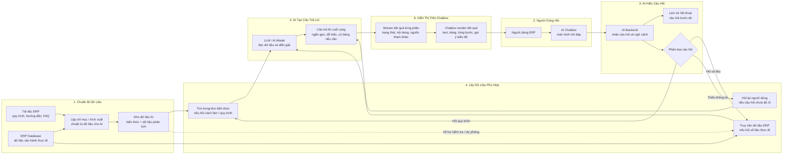

# ERP AI Assistant Chatbox Workflow Diagram

## 1. Tổng Quan Kiến Trúc (High-Level Architecture)

### Workflow Tóm Tắt

| Bước | Khung | Ý nghĩa |
|---|---|---|
| 1 | Chuẩn bị dữ liệu | Hệ thống lấy tài liệu ERP và dữ liệu ERP thật để chuẩn bị cho AI sử dụng. |
| 2 | Người dùng hỏi | Người dùng nhập câu hỏi trực tiếp trong AI Chatbox. |
| 3 | AI hiểu câu hỏi | Backend đọc câu hỏi, xem lịch sử hội thoại và xác định ý định. |
| 4 | Lấy dữ liệu phù hợp | Nếu hỏi quy trình thì tìm trong kho kiến thức; nếu hỏi số liệu thì truy vấn ERP; nếu chưa rõ thì hỏi lại. |
| 5 | AI tạo câu trả lời | LLM đọc dữ liệu liên quan và viết lại thành câu trả lời dễ hiểu. |
| 6 | Hiển thị trên Chatbox | Chatbox nhận kết quả dạng stream và hiển thị cho người dùng. |

### Nguyên Tắc Chính

- AI chỉ đọc dữ liệu ERP, không tự ý chỉnh sửa dữ liệu gốc.
- Mỗi câu hỏi về dữ liệu ERP đều được giới hạn theo đúng công ty/tenant của người dùng.
- Dữ liệu trích xuất dùng để hỗ trợ kiểm tra, tăng tốc hoặc dự phòng; dữ liệu live vẫn lấy từ ERP Database khi cần số liệu mới nhất.

