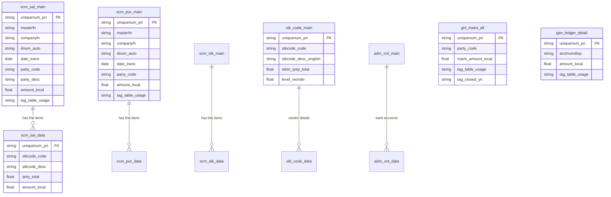

# Kế Hoạch Extract Database & Tạo Tables cho ERP AI Assistant

> **Mục tiêu:** Extract schema từ PostgreSQL ERP (Globe3), tạo các bảng tương ứng trong SQLite, và xây dựng query layer để AI có thể truy vấn dữ liệu ERP một cách an toàn.

---

## 1. Tổng Quan

Hiện tại hệ thống có 2 nguồn dữ liệu:
- **PostgreSQL (Globe3 ERP)** — database chính chứa tất cả dữ liệu ERP
- **SQLite** — database local cho chat history, knowledge base

**Vấn đề:** AI Agent cần truy vấn dữ liệu ERP nhưng PostgreSQL có thể không available hoặc chậm. Cần extract schema và data mẫu vào SQLite để:
1. AI có thể query nhanh local
2. Giảm tải cho PostgreSQL production
3. Có sandbox để test query an toàn

---

## 2. Danh Sách Tables Cần Extract

Dựa vào phân tích tất cả skill tools, đây là các tables và columns thực tế được sử dụng:

### 2.1 Sales Module (`scm_sal_main`)

**Table gốc:** `scm_sal_main` — Sales header (invoices, orders, quotations, etc.)

| Column | Type | Description | Used By |
|--------|------|-------------|---------|
| `uniquenum_pri` | TEXT | Primary key | All sales skills |
| `masterfn` | TEXT | Client scope | All |
| `companyfn` | TEXT | Entity scope | All |
| `dnum_auto` | TEXT | Document number | All |
| `dnum_reference` | TEXT | Reference number | Sales, Sales Invoice |
| `date_trans` | DATE | Transaction date | All |
| `date_due` | DATE | Due date | Sales |
| `party_code` | TEXT | Customer code | All |
| `party_desc` | TEXT | Customer name | All |
| `party_unique` | TEXT | Customer unique ID | Sales |
| `amount_forex` | NUMERIC | Amount in foreign currency | All |
| `amount_local` | NUMERIC | Amount in local currency | All |
| `curr_short_forex` | TEXT | Currency code | All |
| `curr_rate_forex_f_calc` | NUMERIC | Exchange rate | Sales |
| `staff_code` | TEXT | Salesperson code | Sales, Sales Order, SO Confirmation |
| `staff_desc` | TEXT | Salesperson name | Sales |
| `staff_unique` | TEXT | Salesperson unique ID | Sales |
| `location_code` | TEXT | Warehouse/location | Sales, Delivery Order, Sales Quotation |
| `deptunit_code` | TEXT | Department code | Sales |
| `deptunit_desc` | TEXT | Department name | Sales |
| `creditterm_desc` | TEXT | Credit term description | Sales, Sales Invoice |
| `delivtype_desc` | TEXT | Delivery type | Sales |
| `sendby_desc` | TEXT | Send by | Sales |
| `tag_void_yn` | TEXT | Void flag ('n'=active, 'y'=voided) | All |
| `tag_table_usage` | TEXT | Document type discriminator | All |
| `date_lastupdate` | TIMESTAMP | Last update timestamp | Sales, Sales Invoice, SO Confirmation |

**tag_table_usage values:** `sal_inv`, `sal_quo`, `sal_soe`, `sal_soc`, `sal_rta`, `sal_dn`, `sal_cn`, `sal_fma`

### 2.2 Sales Line Items (`scm_sal_data`)

**Table gốc:** `scm_sal_data` — Sales line items (products, qty, price per document)

| Column | Type | Description | Used By |
|--------|------|-------------|---------|
| `uniquenum_pri` | TEXT | FK to scm_sal_main | SCM Overview, AI Risk Analytics |
| `masterfn` | TEXT | Client scope | All |
| `companyfn` | TEXT | Entity scope | All |
| `tag_table_usage` | TEXT | Document type | All |
| `stkcode_code` | TEXT | SKU/Item code | SCM Overview, AI Risk Analytics |
| `stkcode_desc` | TEXT | Product description | SCM Overview |
| `stkcate_desc` | TEXT | Category | SCM Overview, AI Risk Analytics |
| `qnty_total` | NUMERIC | Quantity | SCM Overview, AI Risk Analytics |
| `amount_local` | NUMERIC | Amount in local currency | SCM Overview, AI Risk Analytics |
| `location_code` | TEXT | Location | AI Risk Analytics |
| `tag_void_yn` | TEXT | Void flag | All |
| `date_trans` | DATE | Transaction date | SCM Overview |
| `qnty_uomstk` | NUMERIC | Quantity in stock UOM | AI Risk Analytics |
| `bal_qnty_uomstk` | NUMERIC | Balance quantity | AI Risk Analytics |

### 2.3 Purchase Module (`scm_pur_main`)

**Table gốc:** `scm_pur_main` — Purchase header (PO, PO confirmation, GRN, Purchase Invoice)

| Column | Type | Description | Used By |
|--------|------|-------------|---------|
| `uniquenum_pri` | TEXT | Primary key | All purchase skills |
| `masterfn` | TEXT | Client scope | All |
| `companyfn` | TEXT | Entity scope | All |
| `dnum_auto` | TEXT | Document number | All |
| `dnum_docnum` | TEXT | Document number (alt) | Purchase Order, PO Confirmation |
| `dnum_reference` | TEXT | Reference number | Purchase Order, PO Confirmation |
| `date_trans` | DATE | Transaction date | All |
| `date_due` | DATE | Due date | SCM Overview |
| `date_delivery` | DATE | Delivery date | SCM Overview |
| `party_code` | TEXT | Supplier code | All |
| `party_desc` | TEXT | Supplier name | All |
| `amount_forex` | NUMERIC | Amount in foreign currency | All |
| `amount_local` | NUMERIC | Amount in local currency | All |
| `subtot_forex` | NUMERIC | Subtotal in foreign currency | Purchase Order |
| `subtot_local` | NUMERIC | Subtotal in local currency | Purchase Order |
| `nettot_forex` | NUMERIC | Net total in foreign currency | Purchase Order |
| `nettot_local` | NUMERIC | Net total in local currency | Purchase Order |
| `curr_short_forex` | TEXT | Currency code | All |
| `staff_code` | TEXT | Staff code | Purchase Invoice, Goods Received |
| `location_code` | TEXT | Location | Purchase Requisition |
| `tag_void_yn` | TEXT | Void flag | All |
| `tag_table_usage` | TEXT | Document type discriminator | All |
| `tag_deleted_yn` | TEXT | Deleted flag | AI Risk Analytics |
| `tag_autogen_record_yn` | TEXT | Auto-generated flag | AI Risk Analytics |
| `tag_closed02_yn` | TEXT | Closed flag 02 | AI Risk Analytics |
| `tag_closed03_yn` | TEXT | Closed flag 03 | AI Risk Analytics |

**tag_table_usage values:** `pur_po`, `pur_poc`, `pur_pr`, `pur_pi`, `stk_grn`, `stk_gvn`

### 2.4 Purchase Line Items (`scm_pur_data`)

**Table gốc:** `scm_pur_data` — Purchase line items

| Column | Type | Description | Used By |
|--------|------|-------------|---------|
| `uniquenum_pri` | TEXT | FK to scm_pur_main | AI Risk Analytics |
| `masterfn` | TEXT | Client scope | AI Risk Analytics |
| `companyfn` | TEXT | Entity scope | AI Risk Analytics |
| `tag_table_usage` | TEXT | Document type | AI Risk Analytics |
| `stkcode_code` | TEXT | SKU/Item code | AI Risk Analytics |
| `bal_qnty_uomstk` | NUMERIC | Balance quantity | AI Risk Analytics |
| `tag_void_yn` | TEXT | Void flag | AI Risk Analytics |
| `var_25_003` | TEXT | Document number reference | AI Risk Analytics |

### 2.5 Stock Movement Header (`scm_stk_main`)

**Table gốc:** `scm_stk_main` — Stock movement header (adjustments, transfers)

| Column | Type | Description | Used By |
|--------|------|-------------|---------|
| `uniquenum_pri` | TEXT | Primary key | AI Risk Analytics |
| `masterfn` | TEXT | Client scope | AI Risk Analytics |
| `companyfn` | TEXT | Entity scope | AI Risk Analytics |
| `dnum_auto` | TEXT | Document number | AI Risk Analytics |
| `date_trans` | DATE | Transaction date | AI Risk Analytics |
| `userid_cookie` | TEXT | User who created | AI Risk Analytics |
| `location_code` | TEXT | Location | AI Risk Analytics |
| `tag_table_usage` | TEXT | Document type | AI Risk Analytics |
| `tag_void_yn` | TEXT | Void flag | AI Risk Analytics |

**tag_table_usage values:** `stk_adji`, `stk_adjd`, `stk_badji`, `stk_badjd`, `stk_do`, `stk_doc`

### 2.6 Stock Movement Line Items (`scm_stk_data`)

**Table gốc:** `scm_stk_data` — Stock movement line items

| Column | Type | Description | Used By |
|--------|------|-------------|---------|
| `uniquenum_pri` | TEXT | FK to scm_stk_main | AI Risk Analytics |
| `masterfn` | TEXT | Client scope | AI Risk Analytics |
| `companyfn` | TEXT | Entity scope | AI Risk Analytics |
| `tag_table_usage` | TEXT | Document type | AI Risk Analytics |
| `stkcode_code` | TEXT | SKU/Item code | AI Risk Analytics |
| `stkcode_desc` | TEXT | Product description | AI Risk Analytics |
| `qnty_uomstk` | NUMERIC | Quantity in stock UOM | AI Risk Analytics |
| `qnty_total` | NUMERIC | Total quantity | AI Risk Analytics |
| `amount_local` | NUMERIC | Amount | AI Risk Analytics |
| `tag_void_yn` | TEXT | Void flag | AI Risk Analytics |

### 2.7 Stock Item Master (`stk_code_main`)

**Table gốc:** `stk_code_main` — Stock item master and current stock totals

| Column | Type | Description | Used By |
|--------|------|-------------|---------|
| `uniquenum_pri` | TEXT | Primary key | Stock Item, AI Risk Analytics |
| `masterfn` | TEXT | Client scope | All |
| `companyfn` | TEXT | Entity scope | All |
| `stkcode_code` | TEXT | Item code | All |
| `stkcode_desc_english` | TEXT | Item description (English) | Stock Item, AI Risk Analytics |
| `stkgrp_desc` | TEXT | Product group | AI Risk Analytics |
| `stkcate_desc` | TEXT | Category | AI Risk Analytics, Market Trends |
| `brand_desc` | TEXT | Brand | Market Trends, AI Risk Analytics |
| `uom_stk_code` | TEXT | Stock UOM | AI Risk Analytics |
| `stkm_qnty_total` | NUMERIC | Total stock on hand | AI Risk Analytics, SCM Overview, Market Trends |
| `level_min` | NUMERIC | Minimum level | AI Risk Analytics |
| `level_max` | NUMERIC | Maximum level | AI Risk Analytics, SCM Overview |
| `level_reorder` | NUMERIC | Reorder level | AI Risk Analytics, SCM Overview |
| `amt_cost_mostrecent` | NUMERIC | Most recent cost | AI Risk Analytics |
| `amt_cost_stdnormal` | NUMERIC | Standard cost | AI Risk Analytics |
| `amt_price_stdnormal` | NUMERIC | Standard price | AI Risk Analytics |
| `tag_active_yn` | TEXT | Active flag | Stock Item, AI Risk Analytics, Market Trends |
| `tag_void_yn` | TEXT | Void flag | All |
| `tag_assembly_yn` | TEXT | Assembly flag | Stock Item |
| `tag_taxable_yn` | TEXT | Taxable flag | Stock Item |
| `tag_batch_ctrl_yn` | TEXT | Batch control flag | AI Risk Analytics |
| `tag_serial_ctrl_yn` | TEXT | Serial control flag | AI Risk Analytics |
| `date_lastupdate` | TIMESTAMP | Last update | Stock Item, Project Master |

### 2.8 Stock Item Vendor Data (`stk_code_data`)

**Table gốc:** `stk_code_data` — Stock item vendor/location detail

| Column | Type | Description | Used By |
|--------|------|-------------|---------|
| `uniquenum_pri` | TEXT | Primary key | AI Risk Analytics |
| `masterfn` | TEXT | Client scope | AI Risk Analytics |
| `companyfn` | TEXT | Entity scope | AI Risk Analytics |
| `stkcode_code` | TEXT | FK to stk_code_main | AI Risk Analytics |
| `party_code` | TEXT | Vendor code | AI Risk Analytics |
| `location_code` | TEXT | Location | AI Risk Analytics |
| `vendor_leadtime_days` | TEXT | Lead time (text field) | AI Risk Analytics |
| `num_20_4_d_001` | NUMERIC | Minimum order qty | AI Risk Analytics |
| `tag_table_usage` | TEXT | Record type ('vend' for vendor) | AI Risk Analytics |
| `tag_void_yn` | TEXT | Void flag | AI Risk Analytics |

### 2.9 Customer/Party Master (`adm_cnt_main`)

**Table gốc:** `adm_cnt_main` — Customer/supplier master (inferred from globe3-customer skill)

| Column | Type | Description | Used By |
|--------|------|-------------|---------|
| `uniquenum_pri` | TEXT | Primary key | Customer skill |
| `masterfn` | TEXT | Client scope | Customer skill |
| `companyfn` | TEXT | Entity scope | Customer skill |
| `party_code` | TEXT | Party code | Customer skill |
| `party_desc` | TEXT | Party name | Customer skill |
| `tag_client_vendor` | TEXT | 'c'=client, 'v'=vendor | Customer skill |
| `tag_active_yn` | TEXT | Active flag | Customer skill |
| `creditlimit_client` | NUMERIC | Credit limit | Customer skill |
| `addr_main_nation` | TEXT | Country | Customer skill |
| `addr_main_state` | TEXT | State | Customer skill |

### 2.10 Customer Bank Data (`adm_cnt_data`)

**Table gốc:** `adm_cnt_data` — Customer/supplier bank accounts

| Column | Type | Description | Used By |
|--------|------|-------------|---------|
| `uniquenum_pri` | TEXT | FK to adm_cnt_main | AI Risk Analytics |
| `masterfn` | TEXT | Client scope | AI Risk Analytics |
| `companyfn` | TEXT | Entity scope | AI Risk Analytics |
| `party_code` | TEXT | Party code | AI Risk Analytics |
| `party_desc` | TEXT | Party name | AI Risk Analytics |
| `bankactnum` | TEXT | Bank account number | AI Risk Analytics |
| `bankname` | TEXT | Bank name | AI Risk Analytics |
| `tag_table_usage` | TEXT | Record type ('bank') | AI Risk Analytics |
| `tag_active_yn` | TEXT | Active flag | AI Risk Analytics |

### 2.11 General Ledger Detail (`gen_ledger_detail`)

**Table gốc:** `gen_ledger_detail` — GL journal entries

| Column | Type | Description | Used By |
|--------|------|-------------|---------|
| `uniquenum_pri` | TEXT | Primary key | AI Risk Analytics |
| `masterfn` | TEXT | Client scope | AI Risk Analytics |
| `companyfn` | TEXT | Entity scope | AI Risk Analytics |
| `dnum_auto` | TEXT | Document number | AI Risk Analytics |
| `dnum_docnum` | TEXT | Document number (alt) | AI Risk Analytics |
| `dnum_reference` | TEXT | Reference | AI Risk Analytics |
| `date_trans` | DATE | Transaction date | AI Risk Analytics |
| `date_due` | DATE | Due date | AI Risk Analytics |
| `party_code` | TEXT | Party code | AI Risk Analytics |
| `party_desc` | TEXT | Party name | AI Risk Analytics |
| `acctnumdisp` | TEXT | GL account code | AI Risk Analytics |
| `amount_forex` | NUMERIC | Amount in foreign currency | AI Risk Analytics |
| `amount_local` | NUMERIC | Amount in local currency | AI Risk Analytics |
| `tag_table_usage` | TEXT | Document type | AI Risk Analytics |
| `tag_wflow_app_yn` | TEXT | Workflow approved flag | AI Risk Analytics |
| `tag_actbudforma` | TEXT | Actual/budget flag | AI Risk Analytics |
| `tag_void_yn` | TEXT | Void flag | AI Risk Analytics |
| `bankrec_marker` | TEXT | Bank reconciliation marker | AI Risk Analytics |
| `bankrec_date` | DATE | Bank reconciliation date | AI Risk Analytics |

### 2.12 GL Master/AP-AR (`gnl_maint_all`)

**Table gốc:** `gnl_maint_all` — Unified GL maintenance (AP, AR entries)

| Column | Type | Description | Used By |
|--------|------|-------------|---------|
| `uniquenum_pri` | TEXT | Primary key | AI Risk Analytics |
| `masterfn` | TEXT | Client scope | AI Risk Analytics |
| `companyfn` | TEXT | Entity scope | AI Risk Analytics |
| `dnum_auto` | TEXT | Document number | AI Risk Analytics |
| `dnum_reference` | TEXT | Reference | AI Risk Analytics |
| `maint_dnum_docnum` | TEXT | Maintenance doc number | AI Risk Analytics |
| `maint_date_trans` | DATE | Maintenance transaction date | AI Risk Analytics |
| `maint_date_due` | DATE | Maintenance due date | AI Risk Analytics |
| `maint_amount_local` | NUMERIC | Amount in local currency | AI Risk Analytics |
| `maint_amount_forex` | NUMERIC | Amount in foreign currency | AI Risk Analytics |
| `maint_amount_orig` | NUMERIC | Original amount | AI Risk Analytics |
| `maint_curr_short` | TEXT | Currency | AI Risk Analytics |
| `maint_acctnumdisp` | TEXT | GL account | AI Risk Analytics |
| `maint_cslsegm` | TEXT | Source type segment | AI Risk Analytics |
| `party_code` | TEXT | Party code | AI Risk Analytics |
| `party_desc` | TEXT | Party name | AI Risk Analytics |
| `date_trans` | DATE | Transaction date | AI Risk Analytics |
| `tag_table_usage` | TEXT | Document type ('paya'=AP, 'rece'=AR) | AI Risk Analytics |
| `tag_void_yn` | TEXT | Void flag | AI Risk Analytics |
| `tag_closed_yn` | TEXT | Closed flag | AI Risk Analytics |

### 2.13 Stock Ledger (`stkm_main_all`)

**Table gốc:** `stkm_main_all` — Stock movement ledger (batch/location level)

| Column | Type | Description | Used By |
|--------|------|-------------|---------|
| `uniquenum_pri` | TEXT | Primary key | AI Risk Analytics |
| `masterfn` | TEXT | Client scope | AI Risk Analytics |
| `companyfn` | TEXT | Entity scope | AI Risk Analytics |
| `stkcode_code` | TEXT | SKU code | AI Risk Analytics |
| `location_code` | TEXT | Location | AI Risk Analytics |
| `bin_code` | TEXT | Bin location | AI Risk Analytics |
| `batchnum_code` | TEXT | Batch number | AI Risk Analytics |
| `date_expiry` | DATE | Expiry date | AI Risk Analytics |
| `balance_qnty_uom_stk_code` | NUMERIC | Balance quantity | AI Risk Analytics |
| `value_unitcost_local` | NUMERIC | Unit cost | AI Risk Analytics |
| `tag_void_yn` | TEXT | Void flag | AI Risk Analytics |
| `tag_stkm_valid_yn` | TEXT | Valid flag | AI Risk Analytics |

### 2.14 Memo Long Table (`memo_long_table`)

**Table gốc:** `memo_long_table` — Long-text memos/notes

| Column | Type | Description | Used By |
|--------|------|-------------|---------|
| `uniquenum_pri` | TEXT | Primary key | AI Risk Analytics |
| `masterfn` | TEXT | Client scope | AI Risk Analytics |
| `companyfn` | TEXT | Entity scope | AI Risk Analytics |
| `notes_memo` | TEXT | Memo content | AI Risk Analytics |
| `tag_memo_type` | TEXT | Memo type ('source_list') | AI Risk Analytics |

### 2.15 Project Master (`prj_pbill_main`)

**Table gốc:** `prj_pbill_main` — CRM Tickets / Projects

| Column | Type | Description | Used By |
|--------|------|-------------|---------|
| `uniquenum_pri` | TEXT | Primary key | query-safety whitelist |
| `masterfn` | TEXT | Client scope | query-safety whitelist |
| `companyfn` | TEXT | Entity scope | query-safety whitelist |

### 2.16 Project Body (`prj_pbill_body`)

**Table gốc:** `prj_pbill_body` — Project/CRM ticket body (details)

| Column | Type | Description | Used By |
|--------|------|-------------|---------|
| `uniquenum_pri` | TEXT | Primary key | Project skill |
| `masterfn` | TEXT | Client scope | Project skill |
| `companyfn` | TEXT | Entity scope | Project skill |
| `entprojfn_code` | TEXT | Project code | Project skill |
| `notes_memo` | TEXT | Notes/memo content | Project skill |
| `tag_closed01_yn` | TEXT | Closed flag 1 | Project skill |
| `tag_closed02_yn` | TEXT | Closed flag 2 | Project skill |
| `tag_closed03_yn` | TEXT | Closed flag 3 | Project skill |
| `tag_closed04_yn` | TEXT | Closed flag 4 | Project skill |
| `var_25_001` | TEXT | Custom field 1 | Project skill |
| `var_25_002` | TEXT | Custom field 2 | Project skill |
| `var_25_003` | TEXT | Custom field 3 | Project skill |
| `var_25_004` | TEXT | Custom field 4 | Project skill |
| `num_20_4_d_001` | NUMERIC | Numeric field 1 | Project skill |
| `num_20_4_d_002` | NUMERIC | Numeric field 2 | Project skill |
| `num_20_4_d_003` | NUMERIC | Numeric field 3 | Project skill |
| `num_20_4_d_004` | NUMERIC | Numeric field 4 | Project skill |
| `date_001` | DATE | Date field 1 | Project skill |
| `date_002` | DATE | Date field 2 | Project skill |
| `date_003` | DATE | Date field 3 | Project skill |
| `date_004` | DATE | Date field 4 | Project skill |

### 2.17 GL Stock Ledger (`gen_ledger_stk`)

**Table gốc:** `gen_ledger_stk` — GL stock entries

| Column | Type | Description | Used By |
|--------|------|-------------|---------|
| `uniquenum_pri` | TEXT | Primary key | GL skill |
| `masterfn` | TEXT | Client scope | GL skill |
| `companyfn` | TEXT | Entity scope | GL skill |
| `acctnumdisp` | TEXT | GL account code | GL skill |
| `party_code` | TEXT | Party code | GL skill |
| `party_desc` | TEXT | Party name | GL skill |
| `date_trans` | DATE | Transaction date | GL skill |
| `date_post` | DATE | Posting date | GL skill |
| `fyearcfn` | TEXT | Fiscal year | GL skill |
| `periodmth_cfn` | TEXT | Period | GL skill |
| `staff_code` | TEXT | Staff code | GL skill |
| `deptunit_code` | TEXT | Department code | GL skill |
| `location_code` | TEXT | Location | GL skill |
| `cslsegm` | TEXT | Segment | GL skill |
| `amount_forex` | NUMERIC | Amount in foreign currency | GL skill |
| `amount_local` | NUMERIC | Amount in local currency | GL skill |
| `tag_void_yn` | TEXT | Void flag | GL skill |
| `tag_wflow_app_yn` | TEXT | Workflow approved flag | GL skill |


---

## 3. Cấu Trúc SQLite Target

### 3.1 Database File

```
data/erp_extract.db
```

### 3.2 Script Tạo Tables

File: `scripts/create_erp_extract_tables.sql`

```sql
-- ERP Extract Database for AI Assistant
-- Extracted from Globe3 PostgreSQL

-- 1. Sales Header
CREATE TABLE IF NOT EXISTS scm_sal_main (
    uniquenum_pri TEXT PRIMARY KEY,
    masterfn TEXT NOT NULL,
    companyfn TEXT NOT NULL,
    dnum_auto TEXT,
    dnum_reference TEXT,
    date_trans TEXT,
    date_due TEXT,
    party_code TEXT,
    party_desc TEXT,
    party_unique TEXT,
    amount_forex REAL,
    amount_local REAL,
    curr_short_forex TEXT,
    curr_rate_forex_f_calc REAL,
    staff_code TEXT,
    staff_desc TEXT,
    staff_unique TEXT,
    location_code TEXT,
    deptunit_code TEXT,
    deptunit_desc TEXT,
    creditterm_desc TEXT,
    delivtype_desc TEXT,
    sendby_desc TEXT,
    tag_void_yn TEXT DEFAULT 'n',
    tag_table_usage TEXT NOT NULL,
    date_lastupdate TEXT
);

-- 2. Sales Line Items
CREATE TABLE IF NOT EXISTS scm_sal_data (
    uniquenum_pri TEXT NOT NULL,
    masterfn TEXT NOT NULL,
    companyfn TEXT NOT NULL,
    tag_table_usage TEXT,
    stkcode_code TEXT,
    stkcode_desc TEXT,
    stkcate_desc TEXT,
    qnty_total REAL,
    amount_local REAL,
    location_code TEXT,
    tag_void_yn TEXT DEFAULT 'n',
    date_trans TEXT,
    qnty_uomstk REAL,
    bal_qnty_uomstk REAL,
    PRIMARY KEY (uniquenum_pri, stkcode_code)
);

-- 3. Purchase Header
CREATE TABLE IF NOT EXISTS scm_pur_main (
    uniquenum_pri TEXT PRIMARY KEY,
    masterfn TEXT NOT NULL,
    companyfn TEXT NOT NULL,
    dnum_auto TEXT,
    dnum_docnum TEXT,
    dnum_reference TEXT,
    date_trans TEXT,
    date_due TEXT,
    date_delivery TEXT,
    party_code TEXT,
    party_desc TEXT,
    amount_forex REAL,
    amount_local REAL,
    subtot_forex REAL,
    subtot_local REAL,
    nettot_forex REAL,
    nettot_local REAL,
    curr_short_forex TEXT,
    staff_code TEXT,
    location_code TEXT,
    tag_void_yn TEXT DEFAULT 'n',
    tag_table_usage TEXT NOT NULL,
    tag_deleted_yn TEXT DEFAULT 'n',
    tag_autogen_record_yn TEXT DEFAULT 'n',
    tag_closed02_yn TEXT DEFAULT 'n',
    tag_closed03_yn TEXT DEFAULT 'n'
);

-- 4. Purchase Line Items
CREATE TABLE IF NOT EXISTS scm_pur_data (
    uniquenum_pri TEXT NOT NULL,
    masterfn TEXT NOT NULL,
    companyfn TEXT NOT NULL,
    tag_table_usage TEXT,
    stkcode_code TEXT,
    bal_qnty_uomstk REAL,
    tag_void_yn TEXT DEFAULT 'n',
    var_25_003 TEXT,
    PRIMARY KEY (uniquenum_pri, stkcode_code)
);

-- 5. Stock Movement Header
CREATE TABLE IF NOT EXISTS scm_stk_main (
    uniquenum_pri TEXT PRIMARY KEY,
    masterfn TEXT NOT NULL,
    companyfn TEXT NOT NULL,
    dnum_auto TEXT,
    date_trans TEXT,
    userid_cookie TEXT,
    location_code TEXT,
    tag_table_usage TEXT NOT NULL,
    tag_void_yn TEXT DEFAULT 'n'
);

-- 6. Stock Movement Line Items
CREATE TABLE IF NOT EXISTS scm_stk_data (
    uniquenum_pri TEXT NOT NULL,
    masterfn TEXT NOT NULL,
    companyfn TEXT NOT NULL,
    tag_table_usage TEXT,
    stkcode_code TEXT,
    stkcode_desc TEXT,
    qnty_uomstk REAL,
    qnty_total REAL,
    amount_local REAL,
    tag_void_yn TEXT DEFAULT 'n',
    PRIMARY KEY (uniquenum_pri, stkcode_code)
);

-- 7. Stock Item Master
CREATE TABLE IF NOT EXISTS stk_code_main (
    uniquenum_pri TEXT PRIMARY KEY,
    masterfn TEXT NOT NULL,
    companyfn TEXT NOT NULL,
    stkcode_code TEXT,
    stkcode_desc_english TEXT,
    stkgrp_desc TEXT,
    stkcate_desc TEXT,
    brand_desc TEXT,
    uom_stk_code TEXT,
    stkm_qnty_total REAL,
    level_min REAL,
    level_max REAL,
    level_reorder REAL,
    amt_cost_mostrecent REAL,
    amt_cost_stdnormal REAL,
    amt_price_stdnormal REAL,
    tag_active_yn TEXT DEFAULT 'y',
    tag_void_yn TEXT DEFAULT 'n',
    tag_assembly_yn TEXT DEFAULT 'n',
    tag_taxable_yn TEXT DEFAULT 'n',
    tag_batch_ctrl_yn TEXT DEFAULT 'n',
    tag_serial_ctrl_yn TEXT DEFAULT 'n',
    date_lastupdate TEXT
);

-- 8. Stock Item Vendor Data
CREATE TABLE IF NOT EXISTS stk_code_data (
    uniquenum_pri TEXT PRIMARY KEY,
    masterfn TEXT NOT NULL,
    companyfn TEXT NOT NULL,
    stkcode_code TEXT,
    party_code TEXT,
    location_code TEXT,
    vendor_leadtime_days TEXT,
    num_20_4_d_001 REAL,
    tag_table_usage TEXT,
    tag_void_yn TEXT DEFAULT 'n'
);

-- 9. Customer/Party Master
CREATE TABLE IF NOT EXISTS adm_cnt_main (
    uniquenum_pri TEXT PRIMARY KEY,
    masterfn TEXT NOT NULL,
    companyfn TEXT NOT NULL,
    party_code TEXT,
    party_desc TEXT,
    tag_client_vendor TEXT,
    tag_active_yn TEXT DEFAULT 'y',
    creditlimit_client REAL,
    addr_main_nation TEXT,
    addr_main_state TEXT
);

-- 10. Customer Bank Data
CREATE TABLE IF NOT EXISTS adm_cnt_data (
    uniquenum_pri TEXT NOT NULL,
    masterfn TEXT NOT NULL,
    companyfn TEXT NOT NULL,
    party_code TEXT,
    party_desc TEXT,
    bankactnum TEXT,
    bankname TEXT,
    tag_table_usage TEXT,
    tag_active_yn TEXT DEFAULT 'y',
    PRIMARY KEY (uniquenum_pri, bankactnum)
);

-- 11. General Ledger Detail
CREATE TABLE IF NOT EXISTS gen_ledger_detail (
    uniquenum_pri TEXT PRIMARY KEY,
    masterfn TEXT NOT NULL,
    companyfn TEXT NOT NULL,
    dnum_auto TEXT,
    dnum_docnum TEXT,
    dnum_reference TEXT,
    date_trans TEXT,
    date_due TEXT,
    party_code TEXT,
    party_desc TEXT,
    acctnumdisp TEXT,
    amount_forex REAL,
    amount_local REAL,
    tag_table_usage TEXT,
    tag_wflow_app_yn TEXT DEFAULT 'n',
    tag_actbudforma TEXT DEFAULT 'act',
    tag_void_yn TEXT DEFAULT 'n',
    bankrec_marker TEXT DEFAULT 'n',
    bankrec_date TEXT
);

-- 12. GL Master (AP/AR)
CREATE TABLE IF NOT EXISTS gnl_maint_all (
    uniquenum_pri TEXT PRIMARY KEY,
    masterfn TEXT NOT NULL,
    companyfn TEXT NOT NULL,
    dnum_auto TEXT,
    dnum_reference TEXT,
    maint_dnum_docnum TEXT,
    maint_date_trans TEXT,
    maint_date_due TEXT,
    maint_amount_local REAL,
    maint_amount_forex REAL,
    maint_amount_orig REAL,
    maint_curr_short TEXT,
    maint_acctnumdisp TEXT,
    maint_cslsegm TEXT,
    party_code TEXT,
    party_desc TEXT,
    date_trans TEXT,
    tag_table_usage TEXT,
    tag_void_yn TEXT DEFAULT 'n',
    tag_closed_yn TEXT DEFAULT 'n'
);

-- 13. Stock Ledger
CREATE TABLE IF NOT EXISTS stkm_main_all (
    uniquenum_pri TEXT PRIMARY KEY,
    masterfn TEXT NOT NULL,
    companyfn TEXT NOT NULL,
    stkcode_code TEXT,
    location_code TEXT,
    bin_code TEXT,
    batchnum_code TEXT,
    date_expiry TEXT,
    balance_qnty_uom_stk_code REAL,
    value_unitcost_local REAL,
    tag_void_yn TEXT DEFAULT 'n',
    tag_stkm_valid_yn TEXT DEFAULT 'y'
);

-- 14. Memo Long Table
CREATE TABLE IF NOT EXISTS memo_long_table (
    uniquenum_pri TEXT PRIMARY KEY,
    masterfn TEXT NOT NULL,
    companyfn TEXT NOT NULL,
    notes_memo TEXT,
    tag_memo_type TEXT
);

-- 15. Project Master
CREATE TABLE IF NOT EXISTS prj_pbill_main (
    uniquenum_pri TEXT PRIMARY KEY,
    masterfn TEXT NOT NULL,
    companyfn TEXT NOT NULL
);

-- 16. Project Body (CRM Ticket details)
CREATE TABLE IF NOT EXISTS prj_pbill_body (
    uniquenum_pri TEXT PRIMARY KEY,
    masterfn TEXT NOT NULL,
    companyfn TEXT NOT NULL,
    entprojfn_code TEXT,
    notes_memo TEXT,
    tag_closed01_yn TEXT DEFAULT 'n',
    tag_closed02_yn TEXT DEFAULT 'n',
    tag_closed03_yn TEXT DEFAULT 'n',
    tag_closed04_yn TEXT DEFAULT 'n',
    var_25_001 TEXT,
    var_25_002 TEXT,
    var_25_003 TEXT,
    var_25_004 TEXT,
    num_20_4_d_001 REAL,
    num_20_4_d_002 REAL,
    num_20_4_d_003 REAL,
    num_20_4_d_004 REAL,
    date_001 TEXT,
    date_002 TEXT,
    date_003 TEXT,
    date_004 TEXT
);

-- 17. GL Stock Ledger
CREATE TABLE IF NOT EXISTS gen_ledger_stk (
    uniquenum_pri TEXT PRIMARY KEY,
    masterfn TEXT NOT NULL,
    companyfn TEXT NOT NULL,
    acctnumdisp TEXT,
    party_code TEXT,
    party_desc TEXT,
    date_trans TEXT,
    date_post TEXT,
    fyearcfn TEXT,
    periodmth_cfn TEXT,
    staff_code TEXT,
    deptunit_code TEXT,
    location_code TEXT,
    cslsegm TEXT,
    amount_forex REAL,
    amount_local REAL,
    tag_void_yn TEXT DEFAULT 'n',
    tag_wflow_app_yn TEXT DEFAULT 'n'
);

-- Create indexes for performance
CREATE INDEX IF NOT EXISTS idx_sal_main_scope ON scm_sal_main(masterfn, companyfn);
CREATE INDEX IF NOT EXISTS idx_sal_main_date ON scm_sal_main(date_trans);
CREATE INDEX IF NOT EXISTS idx_sal_main_party ON scm_sal_main(party_code);
CREATE INDEX IF NOT EXISTS idx_sal_main_usage ON scm_sal_main(tag_table_usage);
CREATE INDEX IF NOT EXISTS idx_sal_data_scope ON scm_sal_data(masterfn, companyfn);
CREATE INDEX IF NOT EXISTS idx_sal_data_sku ON scm_sal_data(stkcode_code);
CREATE INDEX IF NOT EXISTS idx_pur_main_scope ON scm_pur_main(masterfn, companyfn);
CREATE INDEX IF NOT EXISTS idx_pur_main_date ON scm_pur_main(date_trans);
CREATE INDEX IF NOT EXISTS idx_pur_main_party ON scm_pur_main(party_code);
CREATE INDEX IF NOT EXISTS idx_pur_main_usage ON scm_pur_main(tag_table_usage);
CREATE INDEX IF NOT EXISTS idx_stk_main_scope ON stk_code_main(masterfn, companyfn);
CREATE INDEX IF NOT EXISTS idx_stk_main_code ON stk_code_main(stkcode_code);
CREATE INDEX IF NOT EXISTS idx_stk_data_scope ON stk_code_data(masterfn, companyfn);
CREATE INDEX IF NOT EXISTS idx_stk_data_code ON stk_code_data(stkcode_code);
CREATE INDEX IF NOT EXISTS idx_cnt_main_scope ON adm_cnt_main(masterfn, companyfn);
CREATE INDEX IF NOT EXISTS idx_cnt_main_party ON adm_cnt_main(party_code);
CREATE INDEX IF NOT EXISTS idx_gl_detail_scope ON gen_ledger_detail(masterfn, companyfn);
CREATE INDEX IF NOT EXISTS idx_gl_detail_date ON gen_ledger_detail(date_trans);
CREATE INDEX IF NOT EXISTS idx_gnl_maint_scope ON gnl_maint_all(masterfn, companyfn);
CREATE INDEX IF NOT EXISTS idx_gnl_maint_party ON gnl_maint_all(party_code);
CREATE INDEX IF NOT EXISTS idx_stkm_scope ON stkm_main_all(masterfn, companyfn);
CREATE INDEX IF NOT EXISTS idx_stkm_sku ON stkm_main_all(stkcode_code);
CREATE INDEX IF NOT EXISTS idx_prj_body_scope ON prj_pbill_body(masterfn, companyfn);
CREATE INDEX IF NOT EXISTS idx_gl_stk_scope ON gen_ledger_stk(masterfn, companyfn);
CREATE INDEX IF NOT EXISTS idx_gl_stk_date ON gen_ledger_stk(date_trans);
CREATE INDEX IF NOT EXISTS idx_gl_stk_account ON gen_ledger_stk(acctnumdisp);

```

### 3.3 Python Extraction Script

File: `scripts/extract_erp_to_sqlite.py`

```python
"""
Extract ERP data from PostgreSQL to SQLite for AI query layer.
Reads from Globe3 PostgreSQL and writes to data/erp_extract.db
"""
import sqlite3
import psycopg2
import os
from datetime import datetime

PG_CONFIG = {
    'host': os.getenv('PG_HOST', 'localhost'),
    'port': int(os.getenv('PG_PORT', 5432)),
    'dbname': os.getenv('PG_DBNAME', 'v57udemo2011_tno'),
    'user': os.getenv('PG_USER', 'postgres'),
    'password': os.getenv('PG_PASSWORD', '123'),
}

SQLITE_PATH = os.path.join(os.path.dirname(__file__), '..', 'data', 'erp_extract.db')
SQL_SCHEMA_PATH = os.path.join(os.path.dirname(__file__), 'create_erp_extract_tables.sql')

# Tables to extract with their SELECT queries
EXTRACT_CONFIG = {
    'scm_sal_main': {
        'query': 'SELECT * FROM scm_sal_main WHERE tag_void_yn = \'n\' LIMIT 1000',
        'batch_size': 500,
    },
    'scm_sal_data': {
        'query': 'SELECT * FROM scm_sal_data WHERE tag_void_yn = \'n\' LIMIT 2000',
        'batch_size': 500,
    },
    'scm_pur_main': {
        'query': 'SELECT * FROM scm_pur_main WHERE tag_void_yn = \'n\' LIMIT 1000',
        'batch_size': 500,
    },
    'scm_pur_data': {
        'query': 'SELECT * FROM scm_pur_data WHERE tag_void_yn = \'n\' LIMIT 2000',
        'batch_size': 500,
    },
    'scm_stk_main': {
        'query': 'SELECT * FROM scm_stk_main WHERE tag_void_yn = \'n\' LIMIT 1000',
        'batch_size': 500,
    },
    'scm_stk_data': {
        'query': 'SELECT * FROM scm_stk_data WHERE tag_void_yn = \'n\' LIMIT 2000',
        'batch_size': 500,
    },
    'stk_code_main': {
        'query': 'SELECT * FROM stk_code_main WHERE tag_void_yn = \'n\' LIMIT 1000',
        'batch_size': 500,
    },
    'stk_code_data': {
        'query': 'SELECT * FROM stk_code_data WHERE tag_void_yn = \'n\' LIMIT 1000',
        'batch_size': 500,
    },
    'adm_cnt_main': {
        'query': 'SELECT * FROM adm_cnt_main LIMIT 1000',
        'batch_size': 500,
    },
    'adm_cnt_data': {
        'query': 'SELECT * FROM adm_cnt_data LIMIT 1000',
        'batch_size': 500,
    },
    'gen_ledger_detail': {
        'query': 'SELECT * FROM gen_ledger_detail WHERE tag_void_yn = \'n\' LIMIT 2000',
        'batch_size': 500,
    },
    'gnl_maint_all': {
        'query': 'SELECT * FROM gnl_maint_all WHERE tag_void_yn = \'n\' LIMIT 2000',
        'batch_size': 500,
    },
    'stkm_main_all': {
        'query': 'SELECT * FROM stkm_main_all WHERE tag_void_yn = \'n\' LIMIT 2000',
        'batch_size': 500,
    },
    'memo_long_table': {
        'query': 'SELECT * FROM memo_long_table LIMIT 500',
        'batch_size': 500,
    },
    'prj_pbill_main': {
        'query': 'SELECT * FROM prj_pbill_main LIMIT 500',
        'batch_size': 500,
    },
    'prj_pbill_body': {
        'query': 'SELECT * FROM prj_pbill_body WHERE tag_deleted_yn = \'n\' LIMIT 500',
        'batch_size': 500,
    },
    'gen_ledger_stk': {
        'query': 'SELECT * FROM gen_ledger_stk WHERE tag_void_yn = \'n\' LIMIT 2000',
        'batch_size': 500,
    },

}


def create_sqlite_schema(conn):
    """Create tables in SQLite from schema file."""
    with open(SQL_SCHEMA_PATH, 'r') as f:
        sql = f.read()
    conn.executescript(sql)
    conn.commit()
    print('[OK] SQLite schema created')


def extract_table(pg_conn, table_name, config):
    """Extract data from PostgreSQL for one table."""
    cur = pg_conn.cursor()
    cur.execute(config['query'])
    columns = [desc[0] for desc in cur.description]
    rows = cur.fetchmany(config['batch_size'])
    all_rows = []
    while rows:
        all_rows.extend(rows)
        rows = cur.fetchmany(config['batch_size'])
    cur.close()
    print(f'  [EXTRACT] {table_name}: {len(all_rows)} rows, {len(columns)} columns')
    return columns, all_rows


def insert_into_sqlite(sqlite_conn, table_name, columns, rows):
    """Insert extracted data into SQLite."""
    if not rows:
        print(f'  [SKIP] {table_name}: no data')
        return
    
    placeholders = ','.join(['?' for _ in columns])
    col_names = ','.join(columns)
    sql = f'INSERT OR IGNORE INTO {table_name} ({col_names}) VALUES ({placeholders})'
    
    cur = sqlite_conn.cursor()
    cur.executemany(sql, rows)
    sqlite_conn.commit()
    print(f'  [INSERT] {table_name}: {cur.rowcount} rows inserted')
    cur.close()


def main():
    print('=== ERP Extract: PostgreSQL → SQLite ===')
    print(f'Source: {PG_CONFIG["host"]}:{PG_CONFIG["port"]}/{PG_CONFIG["dbname"]}')
    print(f'Target: {SQLITE_PATH}')
    
    # Connect to PostgreSQL
    pg_conn = psycopg2.connect(**PG_CONFIG)
    print('[OK] Connected to PostgreSQL')
    
    # Connect to SQLite
    sqlite_conn = sqlite3.connect(SQLITE_PATH)
    print('[OK] Connected to SQLite')
    
    # Create schema
    create_sqlite_schema(sqlite_conn)
    
    # Extract and insert each table
    for table_name, config in EXTRACT_CONFIG.items():
        try:
            columns, rows = extract_table(pg_conn, table_name, config)
            insert_into_sqlite(sqlite_conn, table_name, columns, rows)
        except Exception as e:
            print(f'  [ERROR] {table_name}: {e}')
    
    # Create indexes
    print('\n[INFO] Indexes created via schema SQL')
    
    # Summary
    cur = sqlite_conn.cursor()
    cur.execute("SELECT name FROM sqlite_master WHERE type='table' ORDER BY name")
    tables = cur.fetchall()
    print(f'\n=== Summary: {len(tables)} tables created ===')
    for t in tables:
        cur.execute(f'SELECT COUNT(*) FROM {t[0]}')
        count = cur.fetchone()[0]
        print(f'  {t[0]}: {count} rows')
    cur.close()
    
    pg_conn.close()
    sqlite_conn.close()
    print('\n[DONE] ERP extract completed')


if __name__ == '__main__':
    main()
```

---

## 4. Query Layer cho AI

### 4.1 API Endpoint mới

Thêm endpoint trong `api/routers/`:

```python
# api/routers/erp_query.py
"""
ERP Query Router — cho phép AI query dữ liệu ERP từ SQLite extract.
"""
from fastapi import APIRouter, Depends, HTTPException
from pydantic import BaseModel
import sqlite3
import os

router = APIRouter(prefix="/erp", tags=["erp"])

SQLITE_PATH = os.path.join(os.path.dirname(__file__), '..', '..', 'data', 'erp_extract.db')

class ErpQueryRequest(BaseModel):
    sql: str
    masterfn: str
    companyfn: str

class ErpQueryResponse(BaseModel):
    ok: bool
    columns: list[str]
    rows: list[dict]
    row_count: int

@router.post("/query", response_model=ErpQueryResponse)
async def erp_query(request: ErpQueryRequest):
    """Execute a SELECT query against the ERP extract database."""
    # Validate: only SELECT allowed
    sql_upper = request.sql.strip().upper()
    if not sql_upper.startswith('SELECT'):
        raise HTTPException(status_code=400, detail='Only SELECT queries are allowed')
    
    # Inject scope filters
    sql = inject_scope_filter(request.sql, request.masterfn, request.companyfn)
    
    # Execute
    conn = sqlite3.connect(SQLITE_PATH)
    conn.row_factory = sqlite3.Row
    try:
        cur = conn.cursor()
        cur.execute(sql)
        rows = [dict(row) for row in cur.fetchall()]
        columns = [desc[0] for desc in cur.description] if rows else []
        return ErpQueryResponse(ok=True, columns=columns, rows=rows, row_count=len(rows))
    except Exception as e:
        raise HTTPException(status_code=400, detail=str(e))
    finally:
        conn.close()
```

### 4.2 Scope Injection

```python
def inject_scope_filter(sql: str, masterfn: str, companyfn: str) -> str:
    """Inject masterfn and companyfn filters into the SQL query."""
    scope_filter = f"masterfn = '{masterfn}' AND companyfn = '{companyfn}'"
    
    if 'WHERE' in sql.upper():
        # Insert after WHERE
        idx = sql.upper().index('WHERE') + len('WHERE')
        return f"{sql[:idx]} {scope_filter} AND{sql[idx:]}"
    else:
        # Add WHERE clause before ORDER BY / LIMIT
        for keyword in ['ORDER BY', 'GROUP BY', 'HAVING', 'LIMIT']:
            if keyword in sql.upper():
                idx = sql.upper().index(keyword)
                return f"{sql[:idx]}WHERE {scope_filter} {sql[idx:]}"
        return f"{sql} WHERE {scope_filter}"
```

---

## 5. Task Implementation Checklist

### Phase 1: Schema & Scripts
- [ ] Tạo file `scripts/create_erp_extract_tables.sql` với 17 tables + indexes
- [ ] Tạo file `scripts/extract_erp_to_sqlite.py` với extraction logic
- [ ] Chạy thử extraction script để verify

### Phase 2: API Query Layer
- [ ] Tạo `api/routers/erp_query.py` với endpoint `/erp/query`
- [ ] Đăng ký router trong `api/main.py`
- [ ] Implement scope injection (masterfn + companyfn)
- [ ] Implement query validation (SELECT only, table whitelist)

### Phase 3: Integration với Skills
- [ ] Update `orm-fetch.js` để support SQLite fallback
- [ ] Thêm config flag `USE_SQLITE_EXTRACT` trong `.env`
- [ ] Test các skill tools với SQLite extract

### Phase 4: Testing
- [ ] Test extraction script với data thật
- [ ] Test API endpoint với curl
- [ ] Test scope isolation (cross-company không cho phép)
- [ ] Test performance so với PostgreSQL direct

---

## 6. ER Diagram (Mermaid)



---

## 7. Lưu Ý Quan Trọng

1. **Scope Isolation:** Mọi query PHẢI có `masterfn` và `companyfn` — không cho phép cross-company data leak
2. **Data Freshness:** SQLite extract là snapshot, không realtime. Cần schedule refresh (cron job)
3. **Table Whitelist:** Chỉ cho phép query các tables đã được define trong whitelist
4. **Column Mapping:** Một số columns có tên khác giữa PostgreSQL và SQLite (giữ nguyên tên gốc)
5. **Batch Size:** Extraction nên dùng batch để tránh memory overflow
6. **Error Handling:** T
